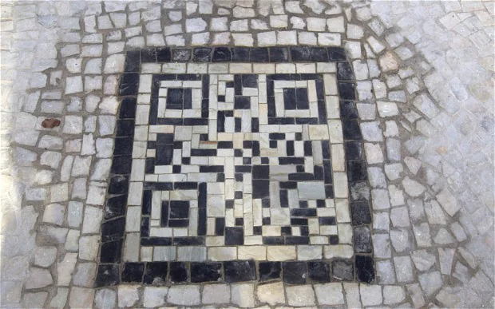

# Mosaic-SR: Adaptive Super-Resolution for 2D Barcodes
This repository contains the code and trained models for Mosaic-SR, a multi-step, adaptive super-resolution (SR) method designed to enhance 2D barcode images (e.g., QR codes, Datamatrix). Mosaic-SR devotes more computational effort to regions with barcodes while minimizing effort on uniform backgrounds. The method predicts an uncertainty value for each patch to determine the number of refinement steps required for optimal quality.



# Repository Structure
```graphql
mosaic-sr/
├── 3rd-party/  
│   └──  ...                                # Contains reference models for comparison
├── buildTFDataset/
│   ├── create_dataset.py                   # Builds a TFRecord dataset from annotations and images 
│   └── functions.py                        # Additional functions
├── config/
│   └──  ...                                # Contains configuration files in YAML format
├── train/
│   ├── train_pytorch_models.py             # Trains multiple Pytorch models (reference models)
│   ├── train_iterative_models.py           # Trains one or more Mosaic-SR models (ours)
│   ├── training_config_function.py         # Contains training hyperparameters, like batch size, lr-scheduling, etc.
│   └──  ...
├── test/
│   ├── Test Quality - Multi.py             # Measures PSNR, SSIM, and Decoding Rate of reference models
│   ├── Test Quality - Multi Iterative.py   # Measures PSNR, SSIM, and Decoding Rate of Mosaic-SR models
│   ├── Test Time - Multi.py                # Measures Processing time of reference models
│   └── Test Time - Multi Iterative.py      # Measures Processing time of Mosaic-SR models
└── utils/
    └──  ...                                # Contains utility functions
```

# Build Repository
Mosaic-SR upscales images patch by patch. An optimized [im2col](https://github.com/Henvezz95/im2col_2D) function is needed to convert the image to patches. The needed SIMD libraries must be built to make the repository work.  

```bash
cd im2col_2D
mkdir build && cd build
cmake -DCMAKE_BUILD_TYPE=Release ..
cmake --build .
```
CMake will detect your CPU architecture and automatically compile the corresponding SIMD implementation.

# Prepare Dataset
# Train Models
# Test Models

